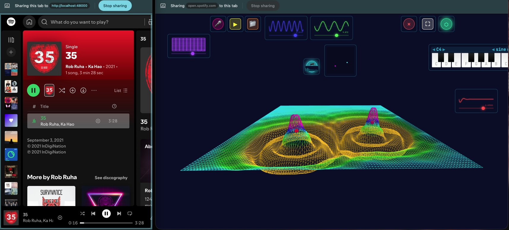

# rmix-BAE (Brane Audio Environment)



A web-based audio processor that uses actual 2D membrane physics for sound transformation. Not a traditional reverb or visualizer — this physically models the actuator-membrane-microphone chain using wave equations.

## The Physics

```
Audio Input → Actuators → 2D Wave Equation → Collectors → Audio Output
```

An actuator drives the membrane the way a speaker cone drives air. A collector samples the membrane the way a microphone samples a room. Between them, the wave equation does what it does — no DSP tricks, no algorithmic reverb, no convolution. Just physics.

### Why the Cone Shape

When you play audio through an actuator, you'll see the membrane form a cone-shaped depression beneath it. This is real.

A speaker cone pushes air molecules away from their resting position. Those molecules push their neighbors, and the disturbance spreads outward — that's sound propagation. But the molecules at the center, right in front of the cone, stay displaced as long as the cone keeps driving them. The result is a pressure well: deepest at the source, smoothing outward.

The membrane shows exactly this. The actuator pushes hardest at its center (Gaussian force spread), the disturbance radiates outward as waves, and the center stays depressed because it keeps getting driven. The cone shape IS the pressure field of a sound source, seen from above.

In air, atmospheric pressure provides a restoring force — it pushes displaced molecules back toward equilibrium, which is why sound oscillates rather than just pushing everything flat. The membrane's equivalent is material stiffness: the tendency of the membrane to return to its rest position regardless of what its neighbors are doing. This is being developed as a configurable parameter (`k` in the wave equation), giving users control over how the membrane recovers — from floppy rubber to tight kevlar.

The current wave equation:

```
∂²u/∂t² = c²∇²u - γ∂u/∂t
```

- `c²∇²u` — Tension. Each point pulls toward its neighbors. This is what makes waves propagate.
- `γ∂u/∂t` — Damping. Energy dissipation. How fast vibrations die out.

With stiffness (in development):

```
∂²u/∂t² = c²∇²u - γ∂u/∂t - ku
```

- `ku` — Stiffness. Each point pulls toward zero (rest position). This is what prevents the cone from sinking indefinitely and makes the membrane oscillate around equilibrium, the way real sound oscillates in air.

### What You're Seeing Is Real

The patterns on the membrane aren't generated for aesthetics. They emerge from the wave equation — interference, standing waves, resonant modes, damping. This is cymatics: the visible structure of vibration. The membrane is colored using a full spectral sweep mapped to displacement height, so you're literally watching energy distribution across a 2D surface in real time.

## Running It

### Docker (easiest — works on any machine with Docker)

```bash
docker compose up -d
```

Open `http://localhost:48000` — that's it. Port 48000 is a nod to the 48kHz audio sample rate.

To share it on your local network, other devices can reach it at `http://<your-machine-ip>:48000`.

To stop it:

```bash
docker compose down
```

### Without Docker

```bash
python3 -m http.server 8765
```

Open `http://127.0.0.1:8765/brane-with-collectors-websocket.html` in Chrome or Firefox.

The app must be served over HTTP — `file://` won't work due to ES module and Web Audio API restrictions.

### Audio Sources
- **Tab capture** — capture audio from any browser tab (Chrome/Edge)
- **Microphone** — system audio input
- **Audio files** — load MP3/WAV
- **Demo loops** — built-in test loops (bass, drums, kick, snare)
- **Keyboard** — play notes directly, audio feeds through manually placed actuators

### Controls
- Click on membrane to add an actuator
- Shift+Click to add a collector
- Drag control tiles to reposition
- Sliders for wave speed, damping, gain

## Architecture

| File | Purpose |
|------|---------|
| `brane-with-collectors-websocket.html` | Main application |
| `membrane-physics-core.js` | Wave equation solver (do not modify) |
| `tiles-config.json` | UI control configuration |
| `default-session.json` | Session state schema |
| `src/pod-runtime.js` | Pod system — modular runtime controls |
| `src/pods/` | Individual control pods (sliders, keyboard) |
| `src/schema/SchemaParser.js` | Session JSON loader/validator |
| `d3.v7.min.js` | Local D3 runtime bundle |
| `three.min.js` / `OrbitControls.js` | Local 3D runtime bundles |
| `Dockerfile` / `docker-compose.yml` | One-command container deployment |
| `research/` | Architecture notes, design decisions, physics exploration |

## License

AGPLv3. Free to use and modify. If you deploy a modified version as a network service, you must publish your source changes under the same license. See [LICENSE](LICENSE).

## Philosophy

> The membrane wobbles regardless of observation. Sometimes those wobbles become Harry.

This isn't about making "realistic reverb." It's about reducing abstraction — simulating the actual physics of sound propagation through a 2D membrane, then sampling it like you'd mic a real acoustic space. The visuals aren't decoration. They're information. What you see is what the sound is doing.

---

*"Make it so creativity is inevitable" — Rick Rubin*
